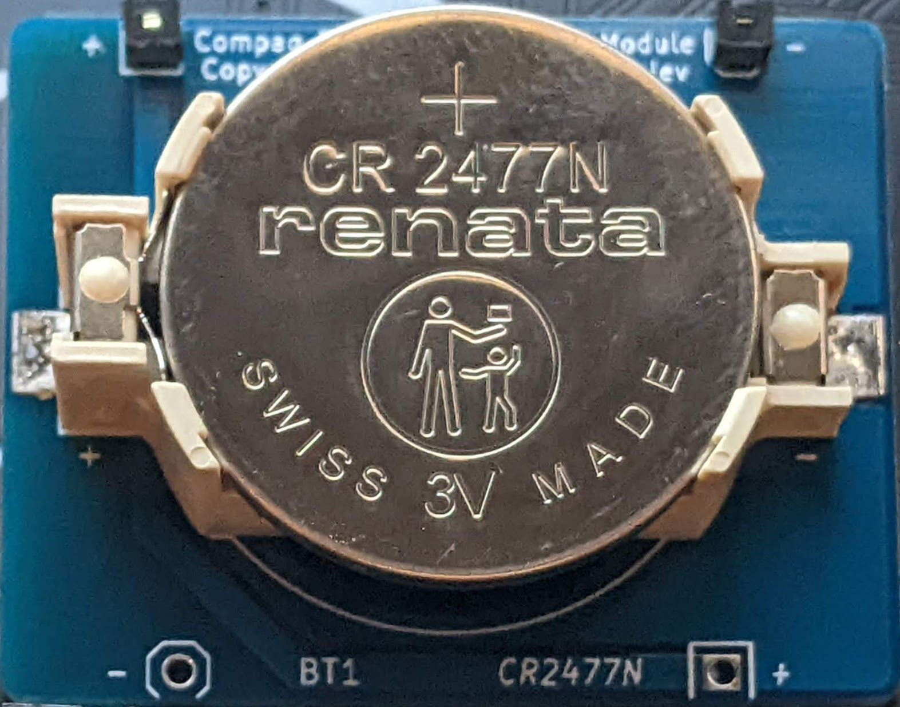

# Compaq Portable III Battery Module
Battery Module for Compaq Portable III

## Introduction

Battery module replacement for the Compaq Portable III using a CR2477N coin cell battery

### Schematic and PCB Layout

[Schematic](KiCad/Compaq_Portable_III_Battery-Schematic.pdf)

[PCB Layout](KiCad/Compaq_Portable_III_Battery-Board.pdf)

### Bill of Materials

[Compaq Portable III Battery Module project on Mouser.com](https://www.mouser.com/ProjectManager/ProjectDetail.aspx?AccessID=ce89cbe21a) - View and order all components except of the PCB.
[Compaq Portable III Battery Module  on OSH Park](https://oshpark.com/shared_projects/eMKmGV3U) - View and order the PCB.

Component type    	| Reference | Description                           | Quantity | Possible sources and notes 
------------------ | --------- | -------------------------------------- | -------- | --------------------------
PCB                |           | Compaq Portable III Battery Module PCB | 1        | Order from a PCB manufacturer of your choice using provided Gerber or KiCad files
Battery Holder     | BT1       | CR2477N coin cell battery holder       | 1        | Mouser [614-SMTU2477N-LF](https://www.mouser.com/ProductDetail/614-SMTU2477N-LF)
Battery            | BT1       | CR2477N coin cell battery              | 1        | Mouser [614-CR2477N.IB](https://www.mouser.com/ProductDetail/614-CR2477N.IB)
Pin Header         | J1-J4     | 1x1 pin header                         | 4        | 

### Assembly Notes

1. Solder pin headers first:
  * Insert the pin headers from the top side of the board "upside down", with the longer ends going through the PCB
  * Flip the board so the bottom side is on the top and place on an even surface
  * Make sure that the pin headers are perpendicular to the board
  * Carefully solder the pin headers, applying the solder and the soldering iron as close to the PCB as possible, avoiding any excess of solder on the pins
2. Solder the battery holder:
  * Tin the PCB pad with a small amount of solder
  * Place the battery holder on the PCB, observing the polarity: The + marking on the battery holder should match the + marking on the PCB
  * Heat the battery holder tabs with a tinned soldering iron, the solder should appear between the tabs and the PCB
3. Insert the battery
